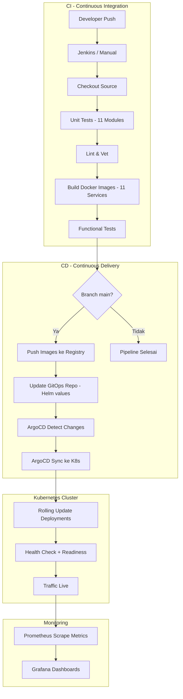

# 🔄 Dokumentasi CI/CD — NusaRoute

> Panduan lengkap untuk mencoba pipeline **Continuous Integration / Continuous Delivery** pada proyek NusaRoute secara menyeluruh, mulai dari commit kode hingga deployment otomatis ke Kubernetes.

---

## 📑 Daftar Isi

1. [Gambaran Umum Pipeline](#1--gambaran-umum-pipeline)
2. [Prasyarat (Prerequisites)](#2--prasyarat-prerequisites)
3. [Arsitektur CI/CD](#3--arsitektur-cicd)
4. [Menjalankan Jenkins (CI Server)](#4--menjalankan-jenkins-ci-server)
5. [Penjelasan Jenkinsfile](#5--penjelasan-jenkinsfile)
6. [Menjalankan CI Secara Manual (Tanpa Jenkins)](#6--menjalankan-ci-secara-manual-tanpa-jenkins)
7. [Build & Push Docker Images](#7--build--push-docker-images)
8. [Deployment ke Kubernetes (CD)](#8--deployment-ke-kubernetes-cd)
9. [GitOps dengan ArgoCD](#9--gitops-dengan-argocd)
10. [Infrastructure as Code (Terraform)](#10--infrastructure-as-code-terraform)
11. [Monitoring & Observability](#11--monitoring--observability)
12. [Troubleshooting](#12--troubleshooting)

---

## 1. 🌐 Gambaran Umum Pipeline

Pipeline CI/CD NusaRoute dirancang untuk mengotomatisasi seluruh siklus hidup pengembangan perangkat lunak — dari kode sumber hingga produksi.

```
┌─────────────┐    ┌──────────────┐    ┌──────────────┐    ┌──────────────┐    ┌──────────────┐    ┌───────────────┐    ┌──────────────┐
│  Developer  │───▶│   Checkout   │───▶│  Unit Tests  │───▶│  Lint & Vet  │───▶│ Build Docker │───▶│  Functional   │───▶│  Push Images │
│  git push   │    │     Code     │    │  (Go test)   │    │  (go vet)    │    │    Images    │    │    Tests      │    │  (Registry)  │
└─────────────┘    └──────────────┘    └──────────────┘    └──────────────┘    └──────────────┘    └───────────────┘    └──────┬───────┘
                                                                                                                              │
                   ┌──────────────┐    ┌──────────────┐                                                                       │
                   │   ArgoCD     │◀───│ Update GitOps│◀──────────────────────────────────────────────────────────────────────────
                   │ Auto-Deploy  │    │    Repo      │
                   └──────┬───────┘    └──────────────┘
                          │
                   ┌──────▼───────┐
                   │  Kubernetes  │
                   │  Production  │
                   └──────────────┘
```

### Ringkasan Stage Pipeline

| # | Stage | Deskripsi | Trigger |
|---|-------|-----------|---------|
| 1 | **Checkout** | Clone repo dari SCM | Setiap push |
| 2 | **Unit Tests** | Menjalankan `go test -tags=unit` untuk semua 10 microservices + API Gateway | Setiap push |
| 3 | **Lint & Vet** | Analisis statis kode Go (`go vet`) | Setiap push |
| 4 | **Build Images** | Build Docker images multi-stage untuk semua services | Setiap push |
| 5 | **Functional Tests** | Integration test dengan infrastruktur nyata (Postgres, Mongo, Redis, Kafka) | Setiap push |
| 6 | **Push Images** | Push ke Docker Hub registry | Hanya branch `main` |
| 7 | **Update GitOps** | Update image tag di Helm values untuk ArgoCD | Hanya branch `main` |

---

## 2. 📋 Prasyarat (Prerequisites)

### Software yang Dibutuhkan

| Software | Versi Minimum | Kegunaan | Cara Install |
|----------|---------------|----------|--------------|
| **Docker Desktop** | 24.x | Container runtime & Docker Compose | [docker.com/desktop](https://www.docker.com/products/docker-desktop/) |
| **Go** | 1.23+ | Build & test backend services | [go.dev/dl](https://go.dev/dl/) |
| **Node.js** | 20 LTS | Build frontend (Next.js) | [nodejs.org](https://nodejs.org/) |
| **kubectl** | 1.28+ | Mengelola Kubernetes cluster | [kubernetes.io/docs](https://kubernetes.io/docs/tasks/tools/) |
| **Minikube** | 1.32+ | Local Kubernetes cluster | [minikube.sigs.k8s.io](https://minikube.sigs.k8s.io/docs/start/) |
| **Jenkins** | 2.426+ | CI Server (Opsional, bisa manual) | [jenkins.io](https://www.jenkins.io/download/) |
| **Terraform** | 1.0+ | Infrastructure as Code | [terraform.io](https://developer.hashicorp.com/terraform/install) |
| **Git** | 2.40+ | Version control | [git-scm.com](https://git-scm.com/downloads) |

### Verifikasi Instalasi

Jalankan perintah berikut untuk memverifikasi bahwa semua tools sudah terinstall:

```powershell
# Verifikasi semua prasyarat
docker --version
docker compose version
go version
node --version
npm --version
kubectl version --client
minikube version
git --version
```

> **Output yang Diharapkan:** Setiap perintah menampilkan nomor versi tanpa error.

---

## 3. 🏗 Arsitektur CI/CD



### Daftar Services yang Di-CI/CD

| No | Service | Dockerfile | Port | Test Files |
|----|---------|------------|------|------------|
| 1 | `api-gateway` | `api-gateway/Dockerfile` | 8080 | `cmd/main_test.go` |
| 2 | `user-service` | `Dockerfile` (multi-stage) | 8001 | `user_service_test.go` |
| 3 | `payment-service` | `Dockerfile` | 8002 | `payment_service_test.go`, `payment_functional_test.go` |
| 4 | `pricing-service` | `Dockerfile` | 8003 | `pricing_service_test.go`, `pricing_functional_test.go` |
| 5 | `order-service` | `Dockerfile` | 8004 | `order_service_test.go` |
| 6 | `courier-service` | `Dockerfile` | 8005 | `courier_service_test.go`, `courier_functional_test.go` |
| 7 | `dispatch-service` | `Dockerfile` | 8006 | `dispatch_service_test.go`, `dispatch_functional_test.go` |
| 8 | `hub-service` | `Dockerfile` | 8007 | `hub_service_test.go`, `hub_functional_test.go` |
| 9 | `tracking-service` | `Dockerfile` | 8008 | `tracking_service_test.go`, `tracking_functional_test.go` |
| 10 | `notification-service` | `Dockerfile` | 8009 | `notification_service_test.go`, `notification_functional_test.go` |
| 11 | `resolution-service` | `Dockerfile` | 8010 | `resolution_service_test.go`, `resolution_functional_test.go` |

---

## 4. 🔧 Menjalankan Jenkins (CI Server)

### Langkah 1: Jalankan Jenkins via Docker

```powershell
# Jalankan Jenkins sebagai container Docker
docker run -d `
  --name jenkins `
  -p 8888:8080 `
  -p 50000:50000 `
  -v jenkins_data:/var/jenkins_home `
  -v /var/run/docker.sock:/var/run/docker.sock `
  jenkins/jenkins:lts
```

### Langkah 2: Ambil Password Awal

```powershell
# Lihat password awal Jenkins
docker exec jenkins cat /var/jenkins_home/secrets/initialAdminPassword
```

### Langkah 3: Setup Jenkins

1. Buka browser: **http://localhost:8888**
2. Masukkan password awal yang didapat dari langkah sebelumnya
3. Pilih **"Install suggested plugins"**
4. Buat akun admin

### Langkah 4: Install Plugin Tambahan

Navigasi ke **Manage Jenkins → Plugins → Available plugins**, lalu install:

| Plugin | Kegunaan |
|--------|----------|
| **Docker Pipeline** | Build Docker images di pipeline |
| **Pipeline** | Support Jenkinsfile |
| **Git** | Integrasi Git SCM |
| **HTML Publisher** | Publish laporan test coverage |

### Langkah 5: Konfigurasi Credentials

Navigasi ke **Manage Jenkins → Credentials → System → Global**:

| Credential ID | Tipe | Deskripsi |
|---------------|------|-----------|
| `dockerhub-credentials` | Username with Password | Akun Docker Hub untuk push images |
| `kubeconfig` | Secret file | File kubeconfig untuk akses Kubernetes |

### Langkah 6: Buat Pipeline Job

1. **New Item** → Nama: `NusaRoute-Pipeline` → Pilih **Pipeline**
2. Di bagian **Pipeline**:
   - **Definition:** `Pipeline script from SCM`
   - **SCM:** Git
   - **Repository URL:** `https://github.com/Iqbaalz28/NusaRoute.git`
   - **Branch:** `*/main` (atau `*/joko` untuk testing)
   - **Script Path:** `back-end/Jenkinsfile`
3. Klik **Save**

### Langkah 7: Jalankan Pipeline

- Klik **"Build Now"** untuk menjalankan pipeline secara manual
- Atau konfigurasi **Webhook** di GitHub untuk trigger otomatis

> **💡 Tip:** Konfigurasi GitHub Webhook di **Settings → Webhooks** dengan URL:
> `http://<jenkins-ip>:8888/github-webhook/`

---

## 5. 📄 Penjelasan Jenkinsfile

File `back-end/Jenkinsfile` mendefinisikan seluruh pipeline. Berikut penjelasan setiap stage:

### Stage 1: Checkout

```groovy
stage('Checkout') {
    steps {
        checkout scm           // Clone repository dari SCM yang dikonfigurasi
        echo 'Source code checked out'
    }
}
```

**Apa yang terjadi:** Jenkins meng-clone seluruh repository ke workspace-nya.

---

### Stage 2: Unit Tests

```groovy
stage('Unit Tests') {
    agent {
        docker { image "golang:1.23-alpine" }    // Jalankan di container Go
    }
    steps {
        dir('back-end') {
            // Loop semua 10 microservices + api-gateway
            // Menjalankan: go test -tags=unit -v -count=1 -coverprofile=... ./...
        }
    }
}
```

**Apa yang terjadi:**
- Membuat container Docker dengan image `golang:1.23-alpine`
- Menjalankan unit test untuk **setiap** microservice secara berurutan
- Flag `-tags=unit` hanya menjalankan test berlabel unit
- Flag `-coverprofile` menghasilkan file laporan coverage
- Laporan coverage dipublish sebagai HTML report

**Services yang ditest:**
```
user-service, payment-service, pricing-service, order-service,
courier-service, dispatch-service, hub-service, tracking-service,
notification-service, resolution-service, api-gateway
```

---

### Stage 3: Lint & Vet

```groovy
stage('Lint & Vet') {
    // Menjalankan go vet ./... untuk setiap service
    // go vet mendeteksi kesalahan potensial yang compiler tidak tangkap
}
```

**Apa yang terjadi:**
- `go vet` menganalisis kode Go untuk menemukan kesalahan umum
- Contoh: format string yang salah, unreachable code, dead assignments
- Jika ada kesalahan, pipeline **akan gagal**

---

### Stage 4: Build Docker Images

```groovy
stage('Build Images') {
    // Build 11 Docker images menggunakan multi-stage Dockerfile
    // Tag format: nusaroute/<service-name>:<build-number>
    //             nusaroute/<service-name>:latest
}
```

**Apa yang terjadi:**
- Build Docker image untuk **setiap** service menggunakan multi-stage build
- Stage 1 (`builder`): Compile Go binary di `golang:1.25-alpine`
- Stage 2 (`production`): Copy binary ke `alpine:3.19` (image size kecil ~15MB)
- Setiap image di-tag dengan `BUILD_NUMBER` dan `latest`

**Contoh build satu service:**
```powershell
docker build `
  --build-arg SERVICE_NAME=user-service `
  -t nusaroute/user-service:42 `
  -t nusaroute/user-service:latest `
  -f Dockerfile .
```

---

### Stage 5: Functional Tests

```groovy
stage('Functional Tests') {
    // 1. Nyalakan infrastruktur (Postgres, MongoDB, Redis, Kafka)
    // 2. Tunggu healthy (30 detik)
    // 3. Jalankan go test -tags=functional
    // 4. Matikan infrastruktur
}
```

**Apa yang terjadi:**
- Menggunakan `docker-compose` untuk menjalankan database & broker secara nyata
- Menjalankan integration test yang berinteraksi dengan Postgres, MongoDB, Redis, dan Kafka
- Setelah selesai, semua container di-cleanup (`docker-compose down -v`)

---

### Stage 6: Push Images (hanya `main` branch)

```groovy
stage('Push Images') {
    when { branch 'main' }     // Hanya dijalankan jika branch = main
    // Push 11 images ke Docker Hub
}
```

**Apa yang terjadi:**
- Mengautentikasi ke Docker Hub menggunakan credential `dockerhub-credentials`
- Push semua 11 images dengan tag `BUILD_NUMBER` dan `latest`

---

### Stage 7: Update GitOps Repo (hanya `main` branch)

```groovy
stage('Update GitOps Repo') {
    when { branch 'main' }
    // Update image tag di Helm values.yaml
    // Commit perubahan ke repo
}
```

**Apa yang terjadi:**
- Menggunakan `sed` untuk mengganti tag image di `values.yaml`
- Commit perubahan dengan pesan `ci: update image tag to <BUILD_NUMBER> [skip ci]`
- Flag `[skip ci]` mencegah pipeline trigger secara rekursif

---

## 6. 🖥 Menjalankan CI Secara Manual (Tanpa Jenkins)

Jika tidak ingin menggunakan Jenkins, setiap stage pipeline bisa dijalankan secara manual:

### Langkah 1: Jalankan Infrastruktur

```powershell
# Masuk ke direktori back-end
cd back-end

# Buat file .env (jika belum ada)
# File .env sudah ada dengan default values, salin ke .env.local jika perlu

# Jalankan semua infrastruktur
docker compose up -d postgres mongodb redis zookeeper kafka
```

Tunggu sampai semua container healthy:

```powershell
# Cek status containers
docker compose ps

# Tunggu Postgres healthy
docker compose exec postgres pg_isready -U nusaroute

# Tunggu Kafka healthy
docker compose exec kafka kafka-broker-api-versions --bootstrap-server localhost:9092
```

### Langkah 2: Jalankan Unit Tests

```powershell
cd back-end

# === Cara 1: Menggunakan Makefile (Memerlukan make / Git Bash) ===
make test-unit

# === Cara 2: Manual per service (PowerShell) ===
$services = @(
    "user-service", "payment-service", "pricing-service", "order-service",
    "courier-service", "dispatch-service", "hub-service", "tracking-service",
    "notification-service", "resolution-service"
)

foreach ($svc in $services) {
    Write-Host "=== Testing $svc ===" -ForegroundColor Cyan
    Push-Location "services\$svc"
    go test -tags=unit -v -count=1 ./...
    if ($LASTEXITCODE -ne 0) {
        Write-Host "FAIL: $svc" -ForegroundColor Red
        Pop-Location
        break
    }
    Pop-Location
}

# Test API Gateway
Write-Host "=== Testing API Gateway ===" -ForegroundColor Cyan
Push-Location "api-gateway"
go test -tags=unit -v -count=1 ./...
Pop-Location

# Test shared packages
Write-Host "=== Testing pkg ===" -ForegroundColor Cyan
Push-Location "pkg"
go test -v -count=1 ./...
Pop-Location
```

### Langkah 3: Jalankan Lint & Vet

```powershell
cd back-end

# === Cara 1: Menggunakan Makefile ===
make lint

# === Cara 2: Manual per service ===
$services = @(
    "user-service", "payment-service", "pricing-service", "order-service",
    "courier-service", "dispatch-service", "hub-service", "tracking-service",
    "notification-service", "resolution-service"
)

foreach ($svc in $services) {
    Write-Host "=== Vetting $svc ===" -ForegroundColor Yellow
    Push-Location "services\$svc"
    go vet ./...
    Pop-Location
}

Push-Location "api-gateway"
go vet ./...
Pop-Location
```

### Langkah 4: Jalankan Functional Tests

```powershell
cd back-end

# Pastikan infrastruktur sudah berjalan (lihat Langkah 1)

# Jalankan functional tests
$services = @("user-service", "payment-service", "order-service")

foreach ($svc in $services) {
    Write-Host "=== Functional Testing $svc ===" -ForegroundColor Magenta
    Push-Location "services\$svc"
    go test -tags=functional -v -count=1 ./...
    Pop-Location
}
```

### Langkah 5: Build Docker Images

```powershell
cd back-end

# Build semua microservices
$services = @(
    "user-service", "payment-service", "pricing-service", "order-service",
    "courier-service", "dispatch-service", "hub-service", "tracking-service",
    "notification-service", "resolution-service"
)

foreach ($svc in $services) {
    Write-Host "=== Building $svc ===" -ForegroundColor Green
    docker build `
        --build-arg SERVICE_NAME=$svc `
        -t "nusaroute/${svc}:latest" `
        -f Dockerfile .
}

# Build API Gateway (Dockerfile terpisah)
Write-Host "=== Building api-gateway ===" -ForegroundColor Green
docker build `
    -t "nusaroute/api-gateway:latest" `
    -f api-gateway/Dockerfile .
```

### Langkah 6: Verifikasi Images

```powershell
# Lihat semua images yang berhasil di-build
docker images | Select-String "nusaroute"

# Cek ukuran images
docker images --format "table {{.Repository}}\t{{.Tag}}\t{{.Size}}" | Select-String "nusaroute"
```

> **Output yang Diharapkan:** 11 images dengan nama `nusaroute/<service-name>`, masing-masing berukuran ~15–25 MB.

---

## 7. 🐳 Build & Push Docker Images

### Push ke Docker Hub

```powershell
# 1. Login ke Docker Hub
docker login -u <username>

# 2. Tag images (jika username Docker Hub berbeda)
$services = @(
    "api-gateway", "user-service", "payment-service", "pricing-service",
    "order-service", "courier-service", "dispatch-service", "hub-service",
    "tracking-service", "notification-service", "resolution-service"
)

foreach ($svc in $services) {
    docker tag "nusaroute/${svc}:latest" "<dockerhub-username>/nusaroute-${svc}:latest"
    docker push "<dockerhub-username>/nusaroute-${svc}:latest"
    Write-Host "Pushed $svc" -ForegroundColor Green
}
```

### Menggunakan Docker Compose (Semua Sekaligus)

```powershell
cd back-end

# Build semua services yang didefinisikan di docker-compose.yml
docker compose build

# Jalankan semua services (termasuk infrastruktur)
docker compose up -d

# Verifikasi semua container berjalan
docker compose ps

# Lihat log semua services
docker compose logs -f --tail=50
```

---

## 8. ☸️ Deployment ke Kubernetes (CD)

### Langkah 1: Setup Minikube

```powershell
# Start Minikube (alokasikan cukup resource untuk 11 services)
minikube start --cpus=4 --memory=8192 --driver=docker

# Verifikasi
minikube status
kubectl cluster-info
```

### Langkah 2: Load Docker Images ke Minikube

Jika menggunakan image lokal (tanpa registry), load images ke Minikube:

```powershell
# Konfigurasi Docker agar mengarah ke Minikube daemon
# (Untuk PowerShell)
& minikube -p minikube docker-env --shell powershell | Invoke-Expression

# ATAU load images satu per satu
$services = @(
    "api-gateway", "user-service", "payment-service", "pricing-service",
    "order-service", "courier-service", "dispatch-service", "hub-service",
    "tracking-service", "notification-service", "resolution-service"
)

foreach ($svc in $services) {
    Write-Host "Loading $svc into Minikube..." -ForegroundColor Cyan
    minikube image load "nusaroute/${svc}:latest"
}
```

### Langkah 3: Deploy Infrastruktur Eksternal

Pastikan infrastruktur (Postgres, MongoDB, Redis, Kafka) berjalan di host atau dalam cluster:

```powershell
# Jalankan infrastruktur di host melalui Docker Compose
cd back-end
docker compose up -d postgres mongodb redis zookeeper kafka
```

### Langkah 4: Deploy ke Kubernetes

**Opsi A: Script Otomatis (Direkomendasikan)**

```powershell
# Jalankan script deployment
.\back-end\deployments\k8s\deploy.ps1
```

Script ini menjalankan 3 langkah secara berurutan:
1. Membuat **Namespace** `nusaroute`
2. Membuat **External Services** (Endpoint ke Postgres, Redis, MongoDB, Kafka, MinIO di host)
3. Menerapkan **Deployments, Services, Secrets, dan HPA**

**Opsi B: Manual Step-by-Step**

```powershell
# 1. Buat Namespace
kubectl apply -f back-end\deployments\k8s\namespace.yaml

# 2. Hubungkan services external
kubectl apply -f back-end\deployments\k8s\external-services.yaml

# 3. Deploy semua services
kubectl apply -f back-end\deployments\k8s\services.yaml
```

### Langkah 5: Verifikasi Deployment

```powershell
# Lihat semua resources di namespace nusaroute
kubectl get all -n nusaroute

# Lihat status pod secara detail
kubectl get pods -n nusaroute -o wide

# Lihat events jika ada yang error
kubectl get events -n nusaroute --sort-by='.lastTimestamp'

# Cek log satu service
kubectl logs -n nusaroute deployment/api-gateway --tail=50

# Cek health endpoint
kubectl port-forward -n nusaroute svc/api-gateway 8080:80
# Kemudian buka: http://localhost:8080/health
```

### Langkah 6: Akses Aplikasi

```powershell
# Dapatkan URL untuk API Gateway (LoadBalancer)
minikube service api-gateway -n nusaroute --url

# Atau gunakan port-forward
kubectl port-forward -n nusaroute svc/api-gateway 8080:80
```

### Detail Kubernetes Resources

| Resource | Nama | Replicas | HPA |
|----------|------|----------|-----|
| Deployment | `api-gateway` | 2 | — |
| Deployment | `user-service` | 2 | — |
| Deployment | `order-service` | 3 | — |
| Deployment | `tracking-service` | 5 | ✅ min:3, max:20 (CPU 70%, Mem 80%) |
| Deployment | `dispatch-service` | 2 | ✅ min:2, max:10 (CPU 60%) |
| Service | `api-gateway` | — | LoadBalancer (port 80 → 8080) |
| Secret | `nusaroute-secrets` | — | JWT, DB, Redis, Mongo credentials |

---

## 9. 🔀 GitOps dengan ArgoCD

ArgoCD mengawasi repository Git dan secara otomatis menyinkronkan perubahan manifest ke Kubernetes cluster.

### Langkah 1: Install ArgoCD via Terraform

```powershell
cd infrastructure\terraform

# Initialize Terraform
terraform init

# Preview perubahan
terraform plan

# Apply (install Istio, ArgoCD, Prometheus)
terraform apply -auto-approve
```

### Langkah 2: Akses ArgoCD UI

```powershell
# Port-forward ArgoCD server
kubectl port-forward svc/argocd-server -n argocd 8443:443

# Ambil password admin
kubectl -n argocd get secret argocd-initial-admin-secret -o jsonpath="{.data.password}" | 
  ForEach-Object { [System.Text.Encoding]::UTF8.GetString([System.Convert]::FromBase64String($_)) }
```

Buka browser: **https://localhost:8443**
- Username: `admin`
- Password: (dari perintah di atas)

### Langkah 3: Konfigurasi ArgoCD Application

Buat file `argocd-app.yaml`:

```yaml
apiVersion: argoproj.io/v1alpha1
kind: Application
metadata:
  name: nusaroute
  namespace: argocd
spec:
  project: default
  source:
    repoURL: https://github.com/Iqbaalz28/NusaRoute.git
    targetRevision: main
    path: back-end/deployments/k8s
  destination:
    server: https://kubernetes.default.svc
    namespace: nusaroute
  syncPolicy:
    automated:
      prune: true          # Hapus resource yang sudah dihapus dari Git
      selfHeal: true       # Perbaiki drift secara otomatis
    syncOptions:
      - CreateNamespace=true
```

```powershell
kubectl apply -f argocd-app.yaml
```

### Alur GitOps

```
Developer Push → Jenkins Build & Test → Jenkins Push Image → Jenkins Update Helm values.yaml
                                                                         ↓
                              Kubernetes ← ArgoCD Sync ← ArgoCD Detect Change di Git
```

---

## 10. 🏗 Infrastructure as Code (Terraform)

Terraform digunakan untuk men-deploy tools platform ke Kubernetes cluster:

### Yang Di-deploy Terraform

| Tool | Chart | Namespace | Kegunaan |
|------|-------|-----------|----------|
| **Istio Base** | `base` | `istio-system` | Service Mesh foundation |
| **Istiod** | `istiod` | `istio-system` | Control plane Istio |
| **ArgoCD** | `argo-cd` | `argocd` | GitOps CD controller |
| **Prometheus + Grafana** | `kube-prometheus-stack` | `monitoring` | Observability |

### Menjalankan Terraform

```powershell
cd infrastructure\terraform

# 1. Initialize (download providers & modules)
terraform init

# 2. Preview perubahan
terraform plan

# 3. Apply perubahan
terraform apply

# 4. (Jika ingin menghapus semua)
terraform destroy
```

### Kustomisasi Variabel

File `variables.tf` dapat dikustomisasi:

```powershell
# Contoh override variabel
terraform apply `
  -var="kubeconfig_path=C:\Users\maula\.kube\config" `
  -var="istio_version=1.20.0" `
  -var="argocd_version=5.51.6" `
  -var="prometheus_version=55.5.1"
```

---

## 11. 📊 Monitoring & Observability

### Prometheus

Semua 11 services mengekspos metrik di endpoint `/metrics`:

```powershell
# Akses Prometheus UI (Docker Compose)
# URL: http://localhost:9090

# Akses Prometheus UI (Kubernetes)
kubectl port-forward -n monitoring svc/prometheus-kube-prometheus-prometheus 9090:9090
```

**Metrik yang tersedia:**
- `http_requests_total` — Total jumlah HTTP request per service
- `http_request_duration_seconds` — Latency distribusi (histogram)
- `go_goroutines` — Jumlah goroutine aktif
- `process_resident_memory_bytes` — Penggunaan memory

### Grafana

```powershell
# Akses Grafana (Docker Compose)
# URL: http://localhost:3001
# Login: admin / nusaroute-grafana-secret (dari .env)

# Akses Grafana (Kubernetes)
kubectl port-forward -n monitoring svc/prometheus-grafana 3001:80
# Login: admin / prom-operator
```

**Dashboard yang bisa dibuat:**
1. **API Gateway Overview** — Request rate, error rate, p99 latency
2. **Service Health** — Uptime semua services
3. **Kafka Consumer Lag** — Lag setiap consumer group
4. **Resource Usage** — CPU & Memory per pod

### Logging

Setiap service menggunakan **Zap Logger** (JSON format) dengan `X-Trace-ID`:

```powershell
# Lihat log service tertentu (Docker Compose)
docker compose logs -f user-service --tail=100

# Lihat log di Kubernetes
kubectl logs -n nusaroute -l app=user-service --tail=100 -f

# Filter log berdasarkan Trace ID
kubectl logs -n nusaroute deployment/api-gateway | Select-String "abc123-trace-id"
```

---

## 12. 🔧 Troubleshooting

### Masalah Umum

#### ❌ Docker build gagal: `COPY failed: no source files were specified`

```powershell
# Pastikan Anda menjalankan docker build dari direktori back-end
cd back-end
docker build --build-arg SERVICE_NAME=user-service -t nusaroute/user-service:latest -f Dockerfile .
```

#### ❌ Unit test gagal: `cannot find package`

```powershell
# Pastikan go workspace sudah dikonfigurasi
cd back-end
go work sync
```

#### ❌ Kubernetes pod CrashLoopBackOff

```powershell
# Cek log pod yang bermasalah
kubectl logs -n nusaroute <pod-name> --previous

# Cek events
kubectl describe pod -n nusaroute <pod-name>

# Kemungkinan penyebab:
# 1. Database belum ready → Cek external-services.yaml IP address
# 2. Secret tidak ditemukan → Pastikan services.yaml sudah di-apply
# 3. Port conflict → Pastikan port tidak digunakan service lain
```

#### ❌ External services tidak terkoneksi dari Minikube

```powershell
# Dapatkan IP host dari dalam Minikube
minikube ssh -- route -n | grep "^0.0.0.0"

# Update IP di external-services.yaml sesuai gateway IP
# Default: 192.168.65.254 (Docker Desktop for Mac)
# Minikube biasanya: 192.168.49.1 atau host.minikube.internal
```

#### ❌ Jenkins tidak bisa build Docker images

```powershell
# Pastikan Docker socket di-mount ke Jenkins container
# -v /var/run/docker.sock:/var/run/docker.sock
# Dan user jenkins ada di group docker
docker exec -u root jenkins bash -c "usermod -aG docker jenkins"
docker restart jenkins
```

#### ❌ ArgoCD sync gagal

```powershell
# Cek status ArgoCD app
kubectl -n argocd get applications

# Lihat detail error sync
kubectl -n argocd describe application nusaroute

# Force sync
kubectl -n argocd patch application nusaroute --type merge -p '{"operation":{"sync":{"force":true}}}'
```

### Health Check Endpoints

Gunakan endpoint berikut untuk memverifikasi bahwa setiap service berjalan:

```powershell
# Via API Gateway (port 8080)
$endpoints = @(
    "/api/v1/auth/health",          # User Service
    "/api/v1/payments/health",      # Payment Service
    "/api/v1/pricing/health",       # Pricing Service
    "/api/v1/orders/health",        # Order Service
    "/api/v1/couriers/health",      # Courier Service
    "/api/v1/dispatch/health",      # Dispatch Service
    "/api/v1/hub/health",           # Hub Service
    "/api/v1/tracking/health",      # Tracking Service
    "/api/v1/notifications/health", # Notification Service
    "/api/v1/resolutions/health"    # Resolution Service
)

foreach ($ep in $endpoints) {
    try {
        $response = Invoke-WebRequest -Uri "http://localhost:8080$ep" -TimeoutSec 5
        Write-Host "✅ $ep — $($response.StatusCode)" -ForegroundColor Green
    } catch {
        Write-Host "❌ $ep — FAILED" -ForegroundColor Red
    }
}
```

---

## 📌 Quick Reference — Perintah Penting

| Aksi | Perintah |
|------|----------|
| Jalankan semua services | `cd back-end && docker compose up -d` |
| Jalankan unit test | `cd back-end && make test-unit` |
| Jalankan lint | `cd back-end && make lint` |
| Build Docker images | `cd back-end && docker compose build` |
| Deploy ke K8s | `.\back-end\deployments\k8s\deploy.ps1` |
| Cek pod status | `kubectl get pods -n nusaroute` |
| Lihat log service | `kubectl logs -n nusaroute deployment/<service>` |
| Install platform tools | `cd infrastructure\terraform && terraform apply` |
| Akses Grafana | `http://localhost:3001` |
| Akses Prometheus | `http://localhost:9090` |
| Jalankan Frontend | `cd front-end && npm run dev` |
| Seed demo data | `cd front-end && npm run seed` |

---

<p align="center">
  <b>NusaRoute CI/CD Documentation — Kelompok 3 · UPI · 2026</b>
</p>
