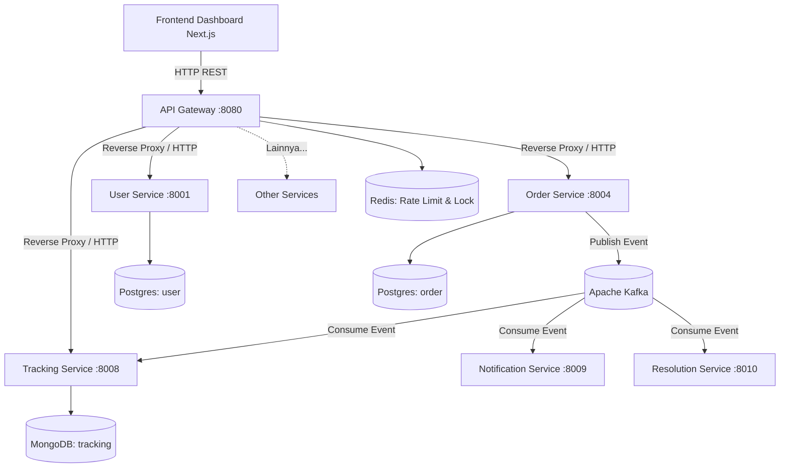

# 🚚 NusaRoute — Solusi Logistik Terintegrasi (Microservices)


> Tugas Besar Mata Kuliah **Distributed, Parallel & Cloud Computing** — Universitas Pendidikan Indonesia

**NusaRoute** adalah platform logistik modern tingkat produksi (production-grade) yang dibangun di atas fondasi **Arsitektur Microservices**, **Event-Driven Architecture (EDA)** menggunakan Apache Kafka, dan antarmuka dinamis dengan **Next.js**. Sistem ini dirancang dengan toleransi kesalahan tinggi (fault-tolerance), skalabilitas horizontal, dan integritas data melalui mekanisme pola CQRS, Outbox, dan Saga.

---

## 📑 Daftar Isi
1. [Arsitektur Sistem](#-arsitektur-sistem)
2. [Tech Stack](#-tech-stack)
3. [Dokumentasi Microservices](#-dokumentasi-microservices)
4. [Skema & Database](#-skema--database)
5. [Fitur Sistem](#-fitur-sistem)
6. [API & Autentikasi](#-api--autentikasi)
7. [Environment Variables](#-environment-variables)
8. [Panduan Instalasi & Deployment](#-panduan-instalasi--deployment)
9. [Monitoring & Logging](#-monitoring--logging)
10. [Struktur Repositori](#-struktur-repositori)
11. [Known Limitations](#-known-limitations)

---

## 📐 Arsitektur Sistem

Sistem NusaRoute berpusat pada **API Gateway Pattern** untuk trafik eksternal dan **Event-Driven Architecture** untuk komunikasi asinkron internal antar-servis.



### Konsep Kunci yang Diimplementasikan:
1. **At-Least-Once Delivery:** Konsumen Kafka (`pkg/kafka`) menarik (`FetchMessage`) lalu hanya menyimpan *offset* (`CommitMessages`) ketika data sudah terekam ke basis data.
2. **Distributed Cron Jobs:** Penjadwalan periodik seperti Pemeriksa Kedaluwarsa SLA dan Pembayaran dijaga oleh **Redis Distributed Lock** (`pkg/redislock`), mencegah balapan eksekusi saat Pod K8s diskalakan.
3. **Outbox Pattern:** Menyelesaikan masalah ketersediaan tinggi di mana setiap service akan menulis Event ke tabel `outbox_events` (PostgreSQL) terlebih dahulu (ACID), kemudian dilempar ke Kafka.
4. **Saga Pattern:** Orkestrasi terdistribusi dalam kasus gagal bayar (Auto-cancel pesanan jika Payment Service tidak mendapatkan pembayaran dalam 24 jam).

---

## 🛠 Tech Stack

### Frontend
- **Framework:** Next.js 16 (App Router), React 19
- **Styling:** Tailwind CSS v4, Lucide Icons
- **State & Data Fetching:** React Context API (Auth), Fetch API bawaan.
- **Resilience:** React Error Boundary.

### Backend (Microservices)
- **Bahasa:** Go 1.23 (Clean Architecture)
- **Komunikasi Internal:** REST HTTP & Apache Kafka (Event-Driven)
- **API Gateway:** Custom Go Reverse Proxy (Rate Limiter, Proxy Timeout, JWT Auth)

### Database
- **PostgreSQL 16:** Penyimpanan relasional utama (Database-per-Service).
- **MongoDB 7:** Penyimpanan dokumen untuk jejak riwayat (`tracking-service`).
- **Redis 7:** Rate limiting, Caching, dan Distributed Locks.

### DevOps & Infrastructure
- **Containerization:** Docker, Docker Compose
- **Orchestration:** Kubernetes (Deployment, ConfigMap, HPA)
- **CI/CD:** Jenkins
- **Observability:** Prometheus, Grafana, Zap Logger

---

## 📦 Dokumentasi Microservices

| Service | Port | Database | Deskripsi & Endpoint Utama |
|---------|------|----------|--------------------------|
| **User Service** | 8001 | PostgreSQL | Manajemen akun, registrasi, otentikasi JWT. |
| **Payment Service** | 8002 | PostgreSQL | Pemrosesan pembayaran, validasi Webhook eksternal. |
| **Pricing Service** | 8003 | PostgreSQL, Redis | Kalkulasi tarif berbasis koordinat (Haversine) & berat volumetrik. |
| **Order Service** | 8004 | PostgreSQL | AWB Engine, Manajemen pesanan (Create, Cancel), SLA Monitor. |
| **Courier Service** | 8005 | PostgreSQL | Ketersediaan armada, pencarian kurir terdekat. |
| **Dispatch Service** | 8006 | PostgreSQL+PostGIS | Algoritma *Vehicle Routing*, *Auto-assign* armada. |
| **Hub Service** | 8007 | PostgreSQL | Manajemen gudang penyortiran, Scan Inbound/Outbound. |
| **Tracking Service** | 8008 | MongoDB | Ledger posisi paket secara *real-time*. |
| **Notification Service**| 8009 | MongoDB | Pengiriman Email/WA asinkron via *worker pool*. |
| **Resolution Service** | 8010 | PostgreSQL | *Ticketing* pelanggan otomatis untuk keluhan & klaim asuransi. |

---

## 🗄 Skema & Database

Sistem ini mematuhi standar *Database-per-Service*, menjamin tidak ada layanan yang membagikan instance tabel secara langsung.
- **Migration:** Terdapat pada `back-end/scripts/init-databases.sql`.
- **Demo Data Seeding:** Tersedia *script* `npm run seed` di *Frontend* yang menjalankan `back-end/scripts/seed.go`. Script ini melakukan penyuntikan (injeksi) secara *bulk* ratusan data realistis (Pesanan, Kurir, Hub) yang tersebar di multi-database untuk menyimulasikan fluktuasi harian dan tren nyata pada Dashboard.

---

## 🚀 Fitur Sistem

### ✅ Fitur Aktif (Implemented)
- Otentikasi Pengguna & Akses Role-Based (JWT).
- Pembuatan Resi (AWB) secara unik dan otomatis.
- Pelacakan Paket (*Live Tracking*) via Dashboard dan Input Nomor Resi.
- *Dashboard Analytics* Agregasi Data Real-Time: Angka dan trend seperti Paket Terkirim, Kurir Aktif, dan Hub di-fetch secara konkuren oleh *API Gateway* (`GET /api/v1/dashboard/stats`).
- Otomatisasi pengiriman Event dari Order ➔ Dispatch ➔ Courier ➔ Tracking.

### 🚧 Fitur Terencana (Planned)
- Implementasi Geolocation interaktif dengan OpenStreetMap / Leaflet (saat ini menggunakan data tiruan lat/long).
- Push Notifications melalui WebSocket ke Frontend klien.

---

## 🛡 API & Autentikasi

- **URL Dasar:** `http://localhost:8080/api/v1`
- **Autentikasi:** JWT (JSON Web Token) via *Header* `Authorization: Bearer <token>`.
- **Format Payload:** `application/json` (Request & Response).

API Gateway menggunakan perlindungan **Rate Limit (100 req/min/IP)** via Redis dan memiliki **Graceful Proxy Timeout** guna mencegah terkurasnya memori server (OOM) apabila terjadi kegagalan jaringan.

---

## ⚙️ Environment Variables

### API Gateway & Backend
Dikonfigurasi melalui `back-end/.env.nusaroute` dan K8s *ConfigMap*:

| Variable | Required | Default | Description |
| -------- | -------- | ------- | ----------- |
| `PORT` | No | `8080` | Port tempat servis berjalan |
| `APP_ENV` | Yes | `development` | `development` atau `production` |
| `JWT_SECRET` | Yes | `nusaroute-jwt-secret...` | Kunci rahasia untuk *signing* token |
| `DATABASE_URL` | Yes | - | URI Koneksi PostgreSQL |
| `MONGO_URI` | Yes | - | URI Koneksi MongoDB |
| `REDIS_ADDR` | Yes | `localhost:6379` | Host & Port Redis |

> **Catatan Keamanan (Fail-Fast):** Jika `APP_ENV=production`, *API Gateway* akan gagal memuat (Crash) jika `JWT_SECRET` masih default. Postgres juga dipaksa menggunakan enkripsi koneksi (`sslmode=require`).

---

## 💻 Panduan Instalasi & Deployment

### 1. Local Development (Docker Compose)
Cara paling mudah menjalankan seluruh ekosistem:

```bash
# Buka direktori back-end
cd back-end

# Build dan jalankan seluruh microservices + DB (Postgres, Mongo, Redis, Kafka)
docker-compose up --build -d

# Periksa log
docker-compose logs -f
```

### 2. Frontend Development (Node.js)
```bash
# Buka direktori front-end
cd front-end

# Install modul (Next.js & React)
npm install

# Jalankan server
npm run dev
```

Dashboard kini dapat diakses melalui: **http://localhost:3000**

### 3. Mengisi Data Demo
Untuk mengisi sistem dengan data tiruan (Pesanan, Pelanggan, Riwayat Paket) agar dashboard tidak kosong:
```bash
cd front-end
npm run seed
```

### 4. Deployment Cloud (Kubernetes)
Konfigurasi manifest berada di `back-end/deployments/k8s/`:
```bash
kubectl apply -f back-end/deployments/k8s/configmap.yaml
kubectl apply -f back-end/deployments/k8s/postgres-deployment.yaml
# ... (lanjutkan untuk Kafka dan microservices)
kubectl apply -f back-end/deployments/k8s/api-gateway.yaml
```

---

## 📊 Monitoring & Logging

- **Logging:** Setiap servis menggunakan `go.uber.org/zap` berformat JSON. API Gateway menyuntikkan `X-Trace-ID` (UUID) yang merambat lintas HTTP Request maupun Event Kafka.
- **Monitoring (Prometheus & Grafana):** Mengekspos metrik HTTP Latency dan Counter Requests di path `/metrics`.

---

## 📁 Struktur Repositori

```text
NusaRoute/
├── front-end/                   # Next.js 16 Web Dashboard
│   ├── app/                     # React App Router Layouts
│   ├── components/              # UI Components (React)
│   ├── lib/                     # API Fetcher & Auth Context
│   └── scripts/                 # seed.js (Data Seeding)
├── back-end/                    # Go Workspace (Microservices)
│   ├── api-gateway/             # API Gateway (BFF, Aggregator, Rate Limiter)
│   ├── pkg/                     # Shared Libs (Kafka, DB, Outbox, Redis Lock)
│   ├── services/                # 10 Microservices
│   ├── scripts/                 # SQL Init Script & seed.go (Bulk Seeder)
│   ├── deployments/k8s/         # Kubernetes Manifests
│   └── docker-compose.yml       # Orchestrator lokal
└── README.md                    # Dokumentasi ini
```

---

## ⚠️ Known Limitations (Keterbatasan Sistem)

1. **Simulasi Pengiriman Kurir:** Perpindahan lokasi GPS kurir dan pergantian status (misal dari "Dikirim" menjadi "Terkirim") belum bergerak secara otonom dari aplikasi *Mobile* (karena aplikasi Mobile Kurir tidak termasuk dalam lingkup ini), sehingga simulasi perubahan *Tracking* masih bersifat pasif.
2. **Tidak ada Event Sourcing Penuh:** Karena kendala kompleksitas, kami menggunakan kombinasi CRUD biasa dan *Outbox Pattern*, bukan murni arsitektur CQRS Event-Sourcing (meskipun layanan logistik seperti `tracking-service` sudah meniru sifat Append-Only Ledger).

---

<p align="center">
  <b>Tugas Besar Kelompok 3 — Universitas Pendidikan Indonesia · 2026</b><br>
  Iqbal Rizky Maulana · Bintang Fajar Putra Pamungkas · Mochammad Azka Basria · Dzaka Musyaffa Hidayat
</p>