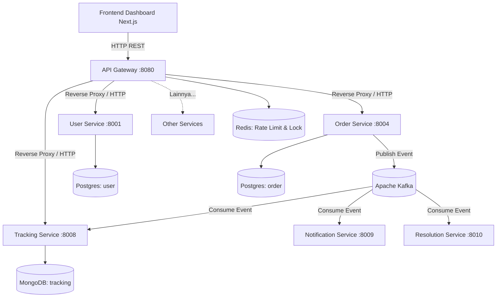
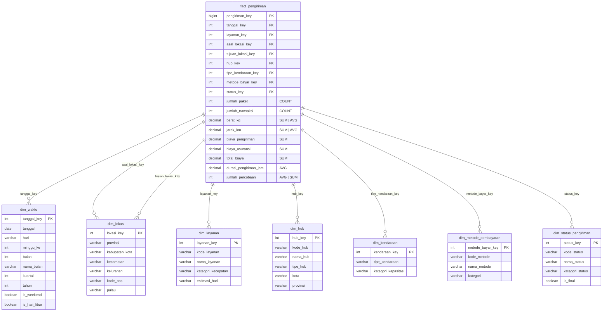

# 🚚 NusaRoute — Solusi Logistik Terintegrasi (Microservices)


> Tugas Besar Mata Kuliah **Distributed, Parallel & Cloud Computing** — Universitas Pendidikan Indonesia

**NusaRoute** adalah platform logistik modern tingkat produksi (production-grade) yang dibangun di atas fondasi **Arsitektur Microservices**, **Event-Driven Architecture (EDA)** menggunakan Apache Kafka, dan antarmuka dinamis dengan **Next.js**. Sistem ini dirancang dengan toleransi kesalahan tinggi (fault-tolerance), skalabilitas horizontal, dan integritas data melalui mekanisme pola CQRS, Outbox, dan Saga.

---

## 📑 Daftar Isi
1. [Arsitektur Sistem](#-arsitektur-sistem)
2. [Tech Stack](#-tech-stack)
3. [Dokumentasi Microservices](#-dokumentasi-microservices)
4. [Skema & Database](#-skema--database)
5. [Fitur Sistem](#-fitur-sistem)
6. [API & Autentikasi](#-api--autentikasi)
7. [Environment Variables](#-environment-variables)
8. [Panduan Instalasi & Deployment](#-panduan-instalasi--deployment)
9. [Monitoring & Logging](#-monitoring--logging)
10. [Struktur Repositori](#-struktur-repositori)
11. [Known Limitations](#-known-limitations)

---

## 📐 Arsitektur Sistem

Sistem NusaRoute berpusat pada **API Gateway Pattern** untuk trafik eksternal dan **Event-Driven Architecture** untuk komunikasi asinkron internal antar-servis.



### Konsep Kunci yang Diimplementasikan:
1. **At-Least-Once Delivery:** Konsumen Kafka (`pkg/kafka`) menarik (`FetchMessage`) lalu hanya menyimpan *offset* (`CommitMessages`) ketika data sudah terekam ke basis data.
2. **Distributed Cron Jobs:** Penjadwalan periodik seperti Pemeriksa Kedaluwarsa SLA dan Pembayaran dijaga oleh **Redis Distributed Lock** (`pkg/redislock`), mencegah balapan eksekusi saat Pod K8s diskalakan.
3. **Outbox Pattern:** Menyelesaikan masalah ketersediaan tinggi di mana setiap service akan menulis Event ke tabel `outbox_events` (PostgreSQL) terlebih dahulu (ACID), kemudian dilempar ke Kafka.
4. **Saga Pattern:** Orkestrasi terdistribusi dalam kasus gagal bayar (Auto-cancel pesanan jika Payment Service tidak mendapatkan pembayaran dalam 24 jam).

---

## 🛠 Tech Stack

### Frontend
- **Framework:** Next.js 16 (App Router), React 19
- **Styling:** Tailwind CSS v4, Lucide Icons
- **State & Data Fetching:** React Context API (Auth), Fetch API bawaan.
- **Resilience:** React Error Boundary.

### Backend (Microservices)
- **Bahasa:** Go 1.23 (Clean Architecture)
- **Komunikasi Internal:** REST HTTP & Apache Kafka (Event-Driven)
- **API Gateway:** Custom Go Reverse Proxy (Rate Limiter, Proxy Timeout, JWT Auth)

### Database
- **PostgreSQL 16:** Penyimpanan relasional utama (Database-per-Service).
- **MongoDB 7:** Penyimpanan dokumen untuk jejak riwayat (`tracking-service`).
- **Redis 7:** Rate limiting, Caching, dan Distributed Locks.

### DevOps & Infrastructure
- **Containerization:** Docker, Docker Compose
- **Orchestration:** Kubernetes (Deployment, ConfigMap, HPA)
- **CI/CD:** Jenkins
- **Observability:** Prometheus, Grafana, Zap Logger

---

## 📦 Dokumentasi Microservices

Setiap microservice memiliki **multiple API endpoints** sesuai prinsip desain microservice yang benar — satu microservice bertanggung jawab atas satu *bounded context* bisnis dan menyediakan beberapa operasi terkait.

| Service | Port | DB | Jumlah Endpoint | Deskripsi |
|---------|------|----|-----------------|-----------|
| **User Service** | 8001 | PostgreSQL | 8 API | Manajemen akun, registrasi, otentikasi JWT, buku alamat. |
| **Payment Service** | 8002 | PostgreSQL | 4 API | Pemrosesan pembayaran, validasi Webhook eksternal. |
| **Pricing Service** | 8003 | PostgreSQL, Redis | 4 API | Kalkulasi tarif berbasis Haversine & berat volumetrik. |
| **Order Service** | 8004 | PostgreSQL | 7 API | AWB Engine, Manajemen pesanan, SLA Monitor, Dashboard Stats. |
| **Courier Service** | 8005 | PostgreSQL | 7 API + gRPC | Manajemen armada, pencarian kurir terdekat, status & lokasi. |
| **Dispatch Service** | 8006 | PostgreSQL+PostGIS | 2 API + 1 Kafka | *Vehicle Routing*, *Auto-assign* armada, No-Show Monitor. |
| **Hub Service** | 8007 | PostgreSQL | 7 API + Stream | Gudang penyortiran, Scan Inbound/Outbound/Sort, Manifest, Analytics Stream. |
| **Tracking Service** | 8008 | MongoDB | 4 API + 5 Kafka | Ledger posisi paket *real-time*, GPS tracking, timeline. |
| **Notification Service**| 8009 | MongoDB | 3 API + 6 Kafka | Pengiriman Email/WA/Push asinkron via *worker pool*. |
| **Resolution Service** | 8010 | PostgreSQL | 7 API + 3 Kafka | *Ticketing* pelanggan otomatis, klaim asuransi. |

### Detail Endpoint per Service

<details>
<summary>📋 <b>User Service</b> — 8 Endpoints</summary>

| Method | Endpoint | Auth | Deskripsi |
|--------|----------|------|-----------|
| `POST` | `/api/v1/auth/register` | Public | Registrasi pengguna baru |
| `POST` | `/api/v1/auth/login` | Public | Login dan terima JWT token |
| `GET` | `/api/v1/auth/health` | Public | Health check |
| `GET` | `/api/v1/users/profile` | JWT | Ambil profil pengguna |
| `PUT` | `/api/v1/users/profile` | JWT | Update profil pengguna |
| `POST` | `/api/v1/users/addresses` | JWT | Tambah alamat baru |
| `GET` | `/api/v1/users/addresses` | JWT | Daftar alamat tersimpan |
| `DELETE` | `/api/v1/users/addresses/{id}` | JWT | Hapus alamat |

</details>

<details>
<summary>📋 <b>Payment Service</b> — 4 Endpoints</summary>

| Method | Endpoint | Auth | Deskripsi |
|--------|----------|------|-----------|
| `POST` | `/api/v1/payments/initiate` | JWT | Inisiasi pembayaran baru |
| `POST` | `/api/v1/payments/webhook` | JWT | Terima callback dari payment gateway |
| `GET` | `/api/v1/payments/{order_id}` | JWT | Cek status pembayaran |
| `GET` | `/api/v1/payments/health` | Public | Health check |

</details>

<details>
<summary>📋 <b>Pricing Service</b> — 4 Endpoints</summary>

| Method | Endpoint | Auth | Deskripsi |
|--------|----------|------|-----------|
| `POST` | `/api/v1/pricing/calculate` | Public | Hitung ongkir satu layanan |
| `POST` | `/api/v1/pricing/compare` | Public | Bandingkan harga semua layanan |
| `GET` | `/api/v1/pricing/services` | Public | Daftar layanan tersedia |
| `GET` | `/api/v1/pricing/health` | Public | Health check |

</details>

<details>
<summary>📋 <b>Order Service</b> — 7 Endpoints</summary>

| Method | Endpoint | Auth | Deskripsi |
|--------|----------|------|-----------|
| `POST` | `/api/v1/orders` | JWT | Buat pesanan baru + generate AWB |
| `GET` | `/api/v1/orders` | JWT | Daftar pesanan milik user (paginated) |
| `GET` | `/api/v1/orders/stats` | Internal | Statistik pesanan hari ini |
| `GET` | `/api/v1/orders/volume` | Internal | Volume harian 7 hari terakhir |
| `GET` | `/api/v1/orders/{id}` | JWT | Detail satu pesanan |
| `PUT` | `/api/v1/orders/{id}` | JWT | Batalkan pesanan |
| `GET` | `/api/v1/orders/health` | Public | Health check |

</details>

<details>
<summary>📋 <b>Courier Service</b> — 7 Endpoints + gRPC</summary>

| Method | Endpoint | Auth | Deskripsi |
|--------|----------|------|-----------|
| `POST` | `/api/v1/couriers/register` | JWT | Registrasi kurir baru |
| `PUT` | `/api/v1/couriers/status` | JWT | Update status online/offline |
| `PUT` | `/api/v1/couriers/location` | JWT | Update lokasi GPS kurir |
| `GET` | `/api/v1/couriers/available` | JWT | Cari kurir tersedia di radius |
| `GET` | `/api/v1/couriers/stats` | Internal | Statistik kurir aktif |
| `GET` | `/api/v1/couriers/{id}` | JWT | Detail satu kurir |
| `GET` | `/api/v1/couriers/health` | Public | Health check |
| gRPC | `GetNearestAvailable` | Internal | Pencarian kurir terdekat via gRPC |

</details>

<details>
<summary>📋 <b>Dispatch Service</b> — 2 Endpoints + 1 Kafka Consumer</summary>

| Method | Endpoint | Auth | Deskripsi |
|--------|----------|------|-----------|
| `GET` | `/api/v1/dispatch/assignments` | JWT | Daftar assignment kurir |
| `GET` | `/api/v1/dispatch/health` | Public | Health check |
| Kafka | `order.ready-for-pickup` | Consumer | Auto-assign kurir terdekat |
| Cron | No-Show Monitor | Background | Deteksi kurir tidak muncul |

</details>

<details>
<summary>📋 <b>Hub Service</b> — 7 Endpoints + Stream Processor</summary>

| Method | Endpoint | Auth | Deskripsi |
|--------|----------|------|-----------|
| `POST` | `/api/v1/hub/scan/inbound` | JWT | Scan paket masuk ke hub |
| `POST` | `/api/v1/hub/scan/outbound` | JWT | Scan paket keluar dari hub |
| `POST` | `/api/v1/hub/scan/sort` | JWT | Scan sortir paket |
| `GET` | `/api/v1/hub/manifest/{hub_id}` | JWT | Manifest paket di hub |
| `GET` | `/api/v1/hub/list` | Public | Daftar semua hub |
| `GET` | `/api/v1/hub/stats` | Internal | Statistik hub & kota |
| `GET` | `/api/v1/hub/health` | Public | Health check |
| Stream | Tumbling Window Analytics | Background | Agregasi scan 1-menit |

</details>

<details>
<summary>📋 <b>Tracking Service</b> — 4 Endpoints + 5 Kafka Consumers</summary>

| Method | Endpoint | Auth | Deskripsi |
|--------|----------|------|-----------|
| `GET` | `/api/v1/tracking/{awb}` | Public | Timeline pelacakan paket |
| `GET` | `/api/v1/tracking/recent` | Public | Event tracking terbaru |
| `POST` | `/api/v1/tracking/gps` | JWT | Update GPS kurir |
| `GET` | `/api/v1/tracking/health` | Public | Health check |
| Kafka | `package.picked-up` | Consumer | Catat event pickup |
| Kafka | `package.scanned-at-hub` | Consumer | Catat event scan hub |
| Kafka | `courier.assigned` | Consumer | Catat event assign kurir |
| Kafka | `package.delivered` | Consumer | Catat event terkirim |
| Kafka | `delivery.failed` | Consumer | Catat event gagal kirim |

</details>

<details>
<summary>📋 <b>Notification Service</b> — 3 Endpoints + 6 Kafka Consumers</summary>

| Method | Endpoint | Auth | Deskripsi |
|--------|----------|------|-----------|
| `GET` | `/api/v1/notifications` | JWT | Daftar notifikasi user |
| `PUT` | `/api/v1/notifications/{id}` | JWT | Tandai notifikasi sudah dibaca |
| `GET` | `/api/v1/notifications/health` | Public | Health check |
| Kafka | `courier.assigned` | Consumer | Notif kurir ditugaskan |
| Kafka | `package.picked-up` | Consumer | Notif paket dijemput |
| Kafka | `package.delivered` | Consumer | Notif paket terkirim |
| Kafka | `delivery.failed` | Consumer | Notif gagal kirim |
| Kafka | `package.lost` | Consumer | Notif paket hilang |
| Kafka | `resolution.created` | Consumer | Notif tiket resolusi |

</details>

<details>
<summary>📋 <b>Resolution Service</b> — 7 Endpoints + 3 Kafka Consumers</summary>

| Method | Endpoint | Auth | Deskripsi |
|--------|----------|------|-----------|
| `POST` | `/api/v1/resolutions/tickets` | JWT | Buat tiket keluhan |
| `GET` | `/api/v1/resolutions/tickets` | JWT | Daftar tiket (paginated) |
| `GET` | `/api/v1/resolutions/tickets/{id}` | JWT | Detail satu tiket |
| `PUT` | `/api/v1/resolutions/tickets/{id}` | JWT | Update status tiket |
| `POST` | `/api/v1/resolutions/claims` | JWT | Buat klaim asuransi |
| `GET` | `/api/v1/resolutions/claims/{id}` | JWT | Detail satu klaim |
| `GET` | `/api/v1/resolutions/health` | Public | Health check |
| Kafka | `delivery.failed` | Consumer | Auto-create tiket gagal kirim |
| Kafka | `package.lost` | Consumer | Auto-create tiket & klaim hilang |
| Kafka | `package.damaged` | Consumer | Auto-create tiket rusak |

</details>

---

## 🗄 Skema & Database

Sistem ini mematuhi standar *Database-per-Service*, menjamin tidak ada layanan yang membagikan instance tabel secara langsung.
- **Migration:** Terdapat pada `back-end/scripts/init-databases.sql`.
- **Demo Data Seeding:** Tersedia *script* `npm run seed` di *Frontend* yang menjalankan `back-end/scripts/seed.go`. Script ini melakukan penyuntikan (injeksi) secara *bulk* ratusan data realistis (Pesanan, Kurir, Hub) yang tersebar di multi-database untuk menyimulasikan fluktuasi harian dan tren nyata pada Dashboard.

---

## ⭐ Star Schema — Data Warehouse

Untuk kebutuhan analitik dan pelaporan agregat, dirancang **Star Schema** yang terpisah dari database operasional (OLTP) masing-masing microservice. Data dari berbagai service di-ETL ke dalam satu Data Warehouse untuk analisis lintas-domain.

### Prinsip Desain Dimensi

> **Mengapa User, Kurir, Transaksi, dan Merchant BUKAN Dimensi?**
>
> Karakteristik utama Data Warehouse adalah **agregat** — kita menganalisis pola dan tren, bukan data per-individu. Entitas seperti User, Kurir, dan Transaksi adalah data operasional (OLTP), bukan dimensi analitik.
>
> Dimensi yang benar adalah **karakteristik kategorikal** yang bisa digunakan untuk *slicing* dan *dicing* data agregat: waktu, lokasi (Provinsi → Kab/Kota → Kecamatan → Kelurahan), tipe layanan, dsb.
>
> Alamat (string bebas) juga **bukan dimensi** — yang menjadi dimensi adalah hirarki geografis: Provinsi, Kabupaten/Kota, Kecamatan, Kelurahan.

### Diagram Star Schema



### Definisi Fact Table: `fact_pengiriman`

| Measure | Tipe Data | Agregasi | Deskripsi |
|---------|-----------|----------|-----------|
| `jumlah_paket` | INT | **COUNT** | Jumlah paket yang dikirim |
| `jumlah_transaksi` | INT | **COUNT** | Jumlah transaksi pembayaran |
| `berat_kg` | DECIMAL(10,2) | **SUM** / **AVG** | Berat paket dalam kilogram |
| `jarak_km` | DECIMAL(10,2) | **SUM** / **AVG** | Jarak pengiriman origin-destination |
| `biaya_pengiriman` | DECIMAL(15,2) | **SUM** | Total ongkos kirim (Rupiah) |
| `biaya_asuransi` | DECIMAL(15,2) | **SUM** | Total biaya asuransi (Rupiah) |
| `total_biaya` | DECIMAL(15,2) | **SUM** | Biaya keseluruhan (ongkir + asuransi) |
| `durasi_pengiriman_jam` | DECIMAL(10,2) | **AVG** | Rata-rata waktu dari pickup → delivered |
| `jumlah_percobaan` | INT | **AVG** / **SUM** | Percobaan pengiriman per paket |

### Definisi Dimension Tables

#### `dim_waktu` — Dimensi Waktu
| Kolom | Tipe | Deskripsi |
|-------|------|-----------|
| `tanggal_key` | INT | Surrogate key format YYYYMMDD |
| `tanggal` | DATE | Tanggal lengkap |
| `hari` | VARCHAR(10) | Senin, Selasa, …, Minggu |
| `minggu_ke` | INT | Minggu ke-N dalam tahun |
| `bulan` | INT | 1–12 |
| `nama_bulan` | VARCHAR(20) | Januari, Februari, …, Desember |
| `kuartal` | INT | 1–4 (Q1 = Jan–Mar) |
| `tahun` | INT | Tahun (2026, dst.) |
| `is_weekend` | BOOLEAN | Apakah Sabtu/Minggu |
| `is_hari_libur` | BOOLEAN | Apakah hari libur nasional |

#### `dim_lokasi` — Dimensi Lokasi / Geografi

> ⚠️ **Bukan "dimensi alamat"** — alamat adalah string bebas. Dimensi lokasi adalah hirarki geografis yang bisa diagregatkan.

| Kolom | Tipe | Deskripsi |
|-------|------|-----------|
| `lokasi_key` | INT | Surrogate key |
| `provinsi` | VARCHAR(100) | Nama provinsi (Jawa Barat, DKI Jakarta, …) |
| `kabupaten_kota` | VARCHAR(100) | Kabupaten atau Kota |
| `kecamatan` | VARCHAR(100) | Kecamatan |
| `kelurahan` | VARCHAR(100) | Kelurahan/Desa |
| `kode_pos` | VARCHAR(10) | Kode pos |
| `pulau` | VARCHAR(50) | Jawa, Sumatera, Kalimantan, Sulawesi, Papua, dll. |

#### `dim_layanan` — Dimensi Tipe Layanan
| Kolom | Tipe | Deskripsi |
|-------|------|-----------|
| `layanan_key` | INT | Surrogate key |
| `kode_layanan` | VARCHAR(10) | REG, YES, CARGO, SAME |
| `nama_layanan` | VARCHAR(50) | Regular, Yakin Esok Sampai, Kargo, Same Day |
| `kategori_kecepatan` | VARCHAR(20) | Standar, Ekspres, Kargo, Same Day |
| `estimasi_hari` | VARCHAR(10) | 2-3, 1, 5-7, 0 |

#### `dim_hub` — Dimensi Hub/Gudang
| Kolom | Tipe | Deskripsi |
|-------|------|-----------|
| `hub_key` | INT | Surrogate key |
| `kode_hub` | VARCHAR(20) | Kode unik hub |
| `nama_hub` | VARCHAR(100) | Nama hub |
| `tipe_hub` | VARCHAR(20) | SORTATION, TRANSIT, DISTRIBUTION |
| `kota` | VARCHAR(100) | Kota lokasi hub |
| `provinsi` | VARCHAR(100) | Provinsi lokasi hub |

#### `dim_kendaraan` — Dimensi Tipe Kendaraan
| Kolom | Tipe | Deskripsi |
|-------|------|-----------|
| `kendaraan_key` | INT | Surrogate key |
| `tipe_kendaraan` | VARCHAR(20) | MOTORCYCLE, CAR, VAN |
| `kategori_kapasitas` | VARCHAR(20) | Ringan (≤5kg), Sedang (≤20kg), Berat (>20kg) |

#### `dim_metode_pembayaran` — Dimensi Metode Pembayaran
| Kolom | Tipe | Deskripsi |
|-------|------|-----------|
| `metode_bayar_key` | INT | Surrogate key |
| `kode_metode` | VARCHAR(20) | VA, E_WALLET, CARD, COD |
| `nama_metode` | VARCHAR(50) | Virtual Account, E-Wallet, Kartu Kredit/Debit, Bayar di Tempat |
| `kategori` | VARCHAR(20) | Digital, Tunai |

#### `dim_status_pengiriman` — Dimensi Status Pengiriman
| Kolom | Tipe | Deskripsi |
|-------|------|-----------|
| `status_key` | INT | Surrogate key |
| `kode_status` | VARCHAR(30) | DELIVERED, CANCELLED, IN_TRANSIT, PENDING, dll. |
| `nama_status` | VARCHAR(50) | Terkirim, Dibatalkan, Dalam Perjalanan, Menunggu |
| `kategori_status` | VARCHAR(20) | Sukses, Gagal, Proses |
| `is_final` | BOOLEAN | Apakah merupakan status akhir |

### Contoh Query Analitik

```sql
-- Query 1: Total jumlah paket (COUNT) dan total pendapatan (SUM) per provinsi tujuan per bulan
SELECT
    dl.provinsi,
    dw.nama_bulan,
    dw.tahun,
    COUNT(f.jumlah_paket)        AS jumlah_paket,       -- COUNT
    SUM(f.total_biaya)           AS total_pendapatan,    -- SUM
    AVG(f.durasi_pengiriman_jam) AS rata_rata_durasi_jam  -- AVG
FROM fact_pengiriman f
JOIN dim_lokasi dl     ON f.tujuan_lokasi_key = dl.lokasi_key
JOIN dim_waktu dw      ON f.tanggal_key = dw.tanggal_key
GROUP BY dl.provinsi, dw.nama_bulan, dw.tahun
ORDER BY dw.tahun, dw.bulan;

-- Query 2: Rata-rata berat (AVG) dan jumlah transaksi (COUNT) per tipe layanan
SELECT
    dly.nama_layanan,
    COUNT(f.jumlah_transaksi) AS jumlah_transaksi,  -- COUNT
    AVG(f.berat_kg)           AS rata_rata_berat_kg, -- AVG
    SUM(f.biaya_pengiriman)   AS total_ongkir        -- SUM
FROM fact_pengiriman f
JOIN dim_layanan dly ON f.layanan_key = dly.layanan_key
GROUP BY dly.nama_layanan;

-- Query 3: Persentase keberhasilan pengiriman per kota asal (agregat status)
SELECT
    dl.kabupaten_kota,
    ds.kategori_status,
    COUNT(f.jumlah_paket) AS jumlah_paket  -- COUNT
FROM fact_pengiriman f
JOIN dim_lokasi dl            ON f.asal_lokasi_key = dl.lokasi_key
JOIN dim_status_pengiriman ds ON f.status_key = ds.status_key
WHERE ds.is_final = true
GROUP BY dl.kabupaten_kota, ds.kategori_status;
```

---

## 🚀 Fitur Sistem

### ✅ Fitur Aktif (Implemented)
- Otentikasi Pengguna & Akses Role-Based (JWT).
- Pembuatan Resi (AWB) secara unik dan otomatis.
- Pelacakan Paket (*Live Tracking*) via Dashboard dan Input Nomor Resi.
- *Dashboard Analytics* Agregasi Data Real-Time: Angka dan trend seperti Paket Terkirim, Kurir Aktif, dan Hub di-fetch secara konkuren oleh *API Gateway* (`GET /api/v1/dashboard/stats`).
- Otomatisasi pengiriman Event dari Order ➔ Dispatch ➔ Courier ➔ Tracking.

### 🚧 Fitur Terencana (Planned)
- Implementasi Geolocation interaktif dengan OpenStreetMap / Leaflet (saat ini menggunakan data tiruan lat/long).
- Push Notifications melalui WebSocket ke Frontend klien.

---

## 🛡 API & Autentikasi

- **URL Dasar:** `http://localhost:8080/api/v1`
- **Autentikasi:** JWT (JSON Web Token) via *Header* `Authorization: Bearer <token>`.
- **Format Payload:** `application/json` (Request & Response).

API Gateway menggunakan perlindungan **Rate Limit (100 req/min/IP)** via Redis dan memiliki **Graceful Proxy Timeout** guna mencegah terkurasnya memori server (OOM) apabila terjadi kegagalan jaringan.

---

## ⚙️ Environment Variables

### API Gateway & Backend
Dikonfigurasi melalui `back-end/.env.nusaroute` dan K8s *ConfigMap*:

| Variable | Required | Default | Description |
| -------- | -------- | ------- | ----------- |
| `PORT` | No | `8080` | Port tempat servis berjalan |
| `APP_ENV` | Yes | `development` | `development` atau `production` |
| `JWT_SECRET` | Yes | `nusaroute-jwt-secret...` | Kunci rahasia untuk *signing* token |
| `DATABASE_URL` | Yes | - | URI Koneksi PostgreSQL |
| `MONGO_URI` | Yes | - | URI Koneksi MongoDB |
| `REDIS_ADDR` | Yes | `localhost:6379` | Host & Port Redis |

> **Catatan Keamanan (Fail-Fast):** Jika `APP_ENV=production`, *API Gateway* akan gagal memuat (Crash) jika `JWT_SECRET` masih default. Postgres juga dipaksa menggunakan enkripsi koneksi (`sslmode=require`).

---

## 💻 Panduan Instalasi & Deployment

### 1. Local Development (Docker Compose)
Cara paling mudah menjalankan seluruh ekosistem:

```bash
# Buka direktori back-end
cd back-end

# Build dan jalankan seluruh microservices + DB (Postgres, Mongo, Redis, Kafka)
docker-compose up --build -d

# Periksa log
docker-compose logs -f
```

### 2. Frontend Development (Node.js)
```bash
# Buka direktori front-end
cd front-end

# Install modul (Next.js & React)
npm install

# Jalankan server
npm run dev
```

Dashboard kini dapat diakses melalui: **http://localhost:3000**

### 3. Mengisi Data Demo
Untuk mengisi sistem dengan data tiruan (Pesanan, Pelanggan, Riwayat Paket) agar dashboard tidak kosong:
```bash
cd front-end
npm run seed
```

### 4. Deployment Cloud (Kubernetes)
Konfigurasi manifest berada di `back-end/deployments/k8s/`:
```bash
kubectl apply -f back-end/deployments/k8s/configmap.yaml
kubectl apply -f back-end/deployments/k8s/postgres-deployment.yaml
# ... (lanjutkan untuk Kafka dan microservices)
kubectl apply -f back-end/deployments/k8s/api-gateway.yaml
```

---

## 📊 Monitoring & Logging

- **Logging:** Setiap servis menggunakan `go.uber.org/zap` berformat JSON. API Gateway menyuntikkan `X-Trace-ID` (UUID) yang merambat lintas HTTP Request maupun Event Kafka.
- **Monitoring (Prometheus & Grafana):** Mengekspos metrik HTTP Latency dan Counter Requests di path `/metrics`.

---

## 📁 Struktur Repositori

```text
NusaRoute/
├── front-end/                   # Next.js 16 Web Dashboard
│   ├── app/                     # React App Router Layouts
│   ├── components/              # UI Components (React)
│   ├── lib/                     # API Fetcher & Auth Context
│   └── scripts/                 # seed.js (Data Seeding)
├── back-end/                    # Go Workspace (Microservices)
│   ├── api-gateway/             # API Gateway (BFF, Aggregator, Rate Limiter)
│   ├── pkg/                     # Shared Libs (Kafka, DB, Outbox, Redis Lock)
│   ├── services/                # 10 Microservices
│   ├── scripts/                 # SQL Init Script & seed.go (Bulk Seeder)
│   ├── deployments/k8s/         # Kubernetes Manifests
│   └── docker-compose.yml       # Orchestrator lokal
└── README.md                    # Dokumentasi ini
```

---

## ⚠️ Known Limitations (Keterbatasan Sistem)

1. **Simulasi Pengiriman Kurir:** Perpindahan lokasi GPS kurir dan pergantian status (misal dari "Dikirim" menjadi "Terkirim") belum bergerak secara otonom dari aplikasi *Mobile* (karena aplikasi Mobile Kurir tidak termasuk dalam lingkup ini), sehingga simulasi perubahan *Tracking* masih bersifat pasif.
2. **Tidak ada Event Sourcing Penuh:** Karena kendala kompleksitas, kami menggunakan kombinasi CRUD biasa dan *Outbox Pattern*, bukan murni arsitektur CQRS Event-Sourcing (meskipun layanan logistik seperti `tracking-service` sudah meniru sifat Append-Only Ledger).

---

<p align="center">
  <b>Tugas Besar Kelompok 3 — Universitas Pendidikan Indonesia · 2026</b><br>
  Iqbal Rizky Maulana · Bintang Fajar Putra Pamungkas · Mochammad Azka Basria · Dzaka Musyaffa Hidayat · Muhammad Maulana Adrian
</p>